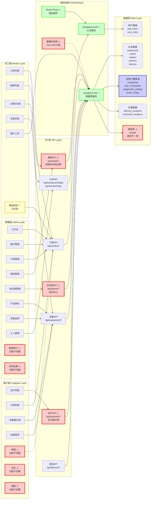

# 项目架构与风险泳道图

## 横向泳道架构图（按端划分）



## 详细组件关系图

```mermaid
graph TB
    subgraph "前端层 Frontend Layer"
        subgraph "管理端 Admin"
            A1[工作台 Dashboard]
            A2[餐厅管理 Restaurants]
            A3[订单管理 Orders]
            A4[报修管理 Repairs]
            A5[供应商管理 Suppliers]
            A6[产品审核 Product Approval]
            A7[设备监控 Devices]
            A8[工人管理 Workers]
            A9[数据统计 Analytics ⚠️]
            A10[系统设置 Settings ⚠️]
        end
        
        subgraph "员工端 Worker"
            W1[订单列表 Order List]
            W2[报修列表 Repair List]
            W3[二维码扫描 QR Scanner]
            W4[设备安装 Device Install]
            W5[图片上传 Image Upload]
            W6[离线同步 Offline Sync ✅]
        end
        
        subgraph "客户端 Customer"
            C1[支付页面 Payment]
            C2[订单列表 Orders]
            C3[设备展示墙 Equipment Showcase]
            C4[设备租赁 Equipment Rental]
            C5[商城 Mall ⚠️]
            C6[社区 Community ⚠️]
            C7[课程 Course ⚠️]
        end
    end
    
    subgraph "API层 API Layer"
        subgraph "认证 API"
            API1[管理员登录 /api/restaurant/login]
            API2[工人登录 /api/worker/login]
            API3[餐厅登录 /api/restaurant/login]
        end
        
        subgraph "业务 API"
            API4[订单 API /api/orders/*]
            API5[报修 API /api/repair/* ⚠️]
            API6[设备 API /api/equipment/*]
            API7[支付 API /api/payment/* ⚠️]
            API8[配送 API /api/delivery/*]
            API9[供应商 API /api/admin/* ⚠️]
        end
    end
    
    subgraph "数据层 Data Layer"
        subgraph "用户相关"
            DB1[(auth.users)]
            DB2[(user_roles)]
            DB3[(user_companies) 🔒]
        end
        
        subgraph "业务数据"
            DB4[(restaurants)]
            DB5[(orders)]
            DB6[(repairs)]
            DB7[(workers)]
            DB8[(devices)]
            DB9[(companies) 🔒]
            DB10[(equipment_catalog) 🔒]
            DB11[(rental_orders) 🔒]
            DB12[(rentals) ⚠️]
        end
        
        subgraph "位置数据"
            DB13[(delivery_locations)]
            DB14[(merchant_locations)]
        end
    end
    
    subgraph "基础设施 Infrastructure"
        INF1[Supabase Auth 🔐]
        INF2[Supabase Database 🔐]
        INF3[Supabase Storage]
        INF4[Next.js API Routes]
        INF5[Route Proxy 🔐]
    end
    
    %% 连接关系
    A1 --> API4
    A2 --> API4
    A3 --> API4
    A4 --> API5
    A5 --> API9
    A6 --> API6
    A7 --> API6
    A8 --> API2
    
    W1 --> API4
    W2 --> API5
    W3 --> API1
    W4 --> API6
    W5 --> INF3
    W6 --> API4
    
    C1 --> API7
    C2 --> API4
    C3 --> API6
    C4 --> API6
    
    API1 --> INF1
    API2 --> INF1
    API3 --> INF1
    API4 --> INF2
    API5 --> INF2
    API6 --> INF2
    API7 --> INF2
    API8 --> INF2
    API9 --> INF2
    
    API9 --> DB1
    API9 --> DB2
    API9 --> DB3
    API9 --> DB9
    
    API4 --> DB5
    API5 --> DB6
    API6 --> DB8
    API6 --> DB10
    API6 --> DB11
    API7 --> DB5
    
    INF1 --> DB1
    INF1 --> DB2
    INF2 --> DB4
    INF2 --> DB5
    INF2 --> DB6
    INF2 --> DB7
    INF2 --> DB8
    INF2 --> DB9
    INF2 --> DB10
    INF2 --> DB11
    INF2 --> DB12
    INF2 --> DB13
    INF2 --> DB14
    
    INF5 --> INF1
    
    %% 样式
    classDef risk fill:#ffcccc,stroke:#ff0000,stroke-width:2px
    classDef secure fill:#ccffcc,stroke:#00ff00,stroke-width:2px
    classDef incomplete fill:#ffffcc,stroke:#ffaa00,stroke-width:2px
    classDef multiTenant fill:#ccccff,stroke:#0000ff,stroke-width:2px
    
    class A9,A10,C5,C6,C7,API5,API7,API9,DB12 risk
    class INF1,INF2,INF5,DB3,DB9,DB10,DB11 secure
    class W6 incomplete
    class DB3,DB9,DB10,DB11 multiTenant
```

## 风险点说明

### 🔴 高风险区域（红色标注）
- **A9, A10**: 数据统计、系统设置 - 功能不完整
- **C5, C6, C7**: 商城、社区、课程 - 功能不完整
- **API5**: 报修API - 权限验证被注释
- **API7**: 支付API - 回调处理不完整，仅沙箱环境
- **API9**: 供应商API - 使用Service Role Key绕过RLS
- **DB12**: rentals表 - 与rental_orders表结构不一致

### 🟢 安全控制区域（绿色标注）
- **INF1**: Supabase Auth - 认证服务
- **INF2**: Supabase Database - 数据库服务
- **INF5**: Route Proxy - 路由保护
- **DB3, DB9, DB10, DB11**: 多租户相关表 - 需要严格隔离

### 🟡 部分完成区域（黄色标注）
- **W6**: 离线同步 - 已实现但需要进一步测试

### 🔵 多租户隔离区域（蓝色标注）
- **DB3**: user_companies - 用户公司关联表
- **DB9**: companies - 供应商公司表
- **DB10**: equipment_catalog - 设备目录表（按provider_id隔离）
- **DB11**: rental_orders - 租赁订单表（按provider_id隔离）

## 数据流向说明

### 认证流程
1. 用户登录 → Supabase Auth → 生成JWT Token
2. Token存储在Cookie → Route Proxy验证 → 允许访问

### 业务数据流程
1. 前端请求 → Next.js API Routes
2. API验证权限 → 查询Supabase Database
3. 多租户过滤 → 返回数据 → 前端展示

### 多租户隔离流程
1. 获取当前用户ID → 查询user_companies表
2. 获取company_id → 在查询中添加provider_id过滤
3. 确保数据隔离

## 关键风险路径

### 路径1：供应商管理（高风险）
```
Admin端 → API9(/api/admin/create-company) 
→ 使用Service Role Key绕过RLS 
→ 直接操作companies表
```
**风险**: 绕过数据库权限控制，难以审计

### 路径2：报修管理（高风险）
```
Worker端 → API5(/api/repair/list) 
→ 权限验证被注释 
→ 直接查询repairs表
```
**风险**: 权限验证缺失，可能数据泄露

### 路径3：支付流程（高风险）
```
Customer端 → API7(/api/payment/alipay/create) 
→ 仅沙箱环境 
→ 回调处理不完整
```
**风险**: 生产环境无法使用，支付流程不完整

### 路径4：多租户数据隔离（中风险）
```
各端 → API Routes 
→ 部分API未强制添加company_id过滤 
→ 查询业务数据
```
**风险**: 可能跨租户数据泄露
